# Lane Line and Vehicle detection

C++ implementation of the Advanced line finding and Vehicle detection of
Udacity Self-Driving Car Engineer Nanodegree course.

Software pipeline to simultaneously detect vehicles and identify lane boundaries in a given input video.

 </p>

# Lane lines detection

## Camera calibration

The camera calibration process is done to eliminate the distortion that is added by the camera lens. In this process, photos of a board are used, from different angles with the same camera.

The process consists of relating the points of the corners detected in the images (chess board images), with a perfectly rectangular arrangement (like the board in real life). Once these point relationships are detected, the coefficients of radial distortion that the camera adds to the pictures are estimated.

Once you have this coeffitients, it is possible to correct the distortion by applying the inverse transformation to the new images. In this way, objects that are straight in real life can be seen straight in the images.

Original board image       |  Undistorted board image
:-------------------------:|:-------------------------:
  </p>  |  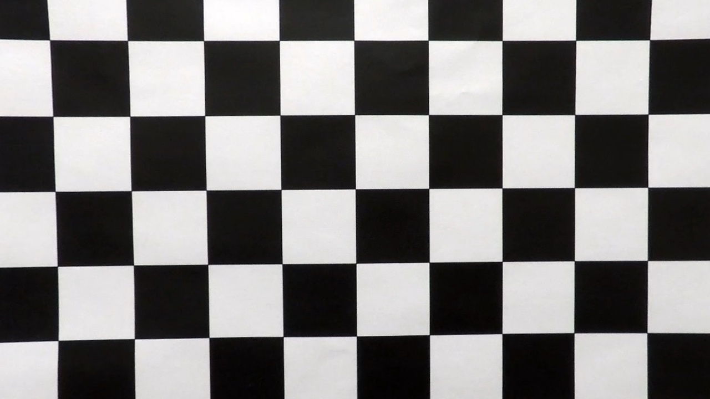 </p>

Original image             |  Undistorted image
:-------------------------:|:-------------------------:
  </p>  |  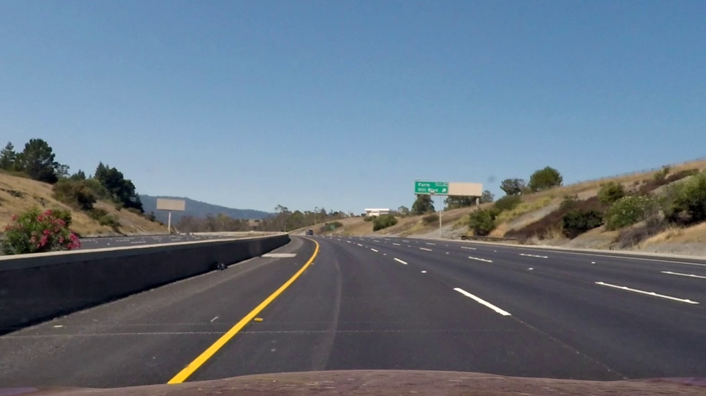 </p>


## Edges and color detection 

The lines we are trying to detect have two key features that will be used together for successful line detection.

The first is their own color, in the test videos we can find them as white or yellow lines. The second is the color contrast between the lines and the road. 

To take advantage of these features we will apply two types of filters, filters by color to save the white and yellow colors, and derivative operations on the images to detect color changes (edges). 

For the color filter process sometimes is convenient to change the color space. By default the images are represented in RGB color space (Red, Green and Blue), in this case the image have three channels, one for each color intensity. The problem with this color space for color filtering, is that each color is a combination of the three channels, which makes the selection of a color range not so clear. But there are a lot of variants that can help us to achieve our goal easier. 

The HSV color space can be much more useful in this case, in this color space each channel of the image represents Hue, saturation and Value. In the following comparison shows the difference in intensity of each channel for an image of the road. 

[Color spaces reference](https://www.learnopencv.com/color-spaces-in-opencv-cpp-python/)

Hue channel     |    Saturation channel       |  Value channel
:--------------:|:--------------------:|:-------------------:
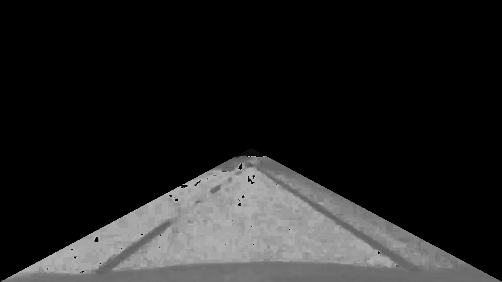  </p>  |  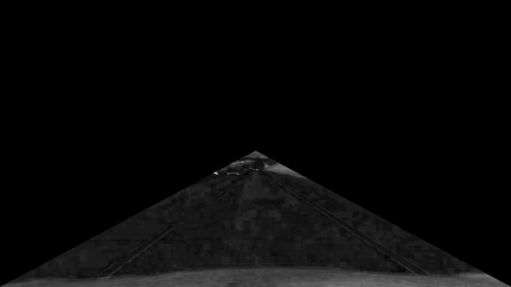 </p> | 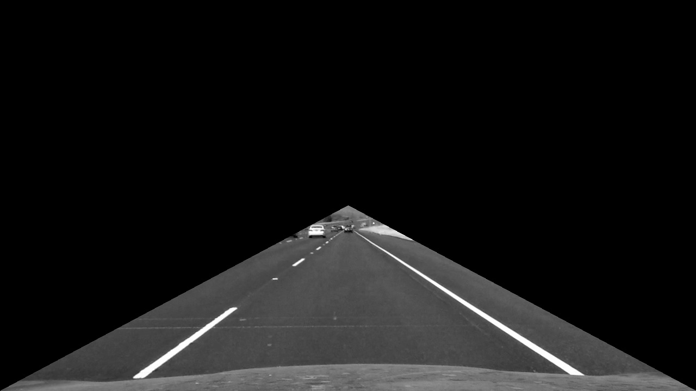 </p>


In this way it becomes easier to detect color, since we only have to discriminate using a color channel. In the same way, the Lab space is used and the L channel (lightness) is extracted to discriminate the white color.


Value mask (HSV)     |    L channel (LabB)       |  Edges mask
:--------------:|:--------------------:|:-------------------:
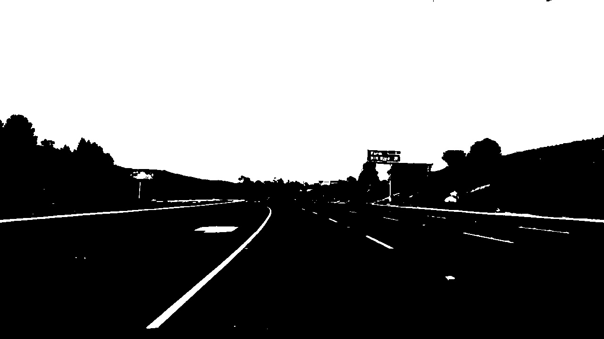  </p>  |  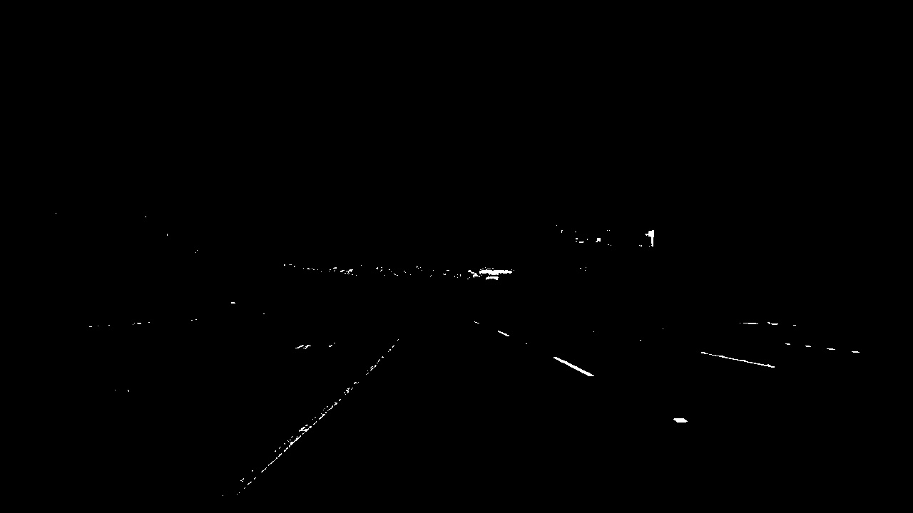 </p> | 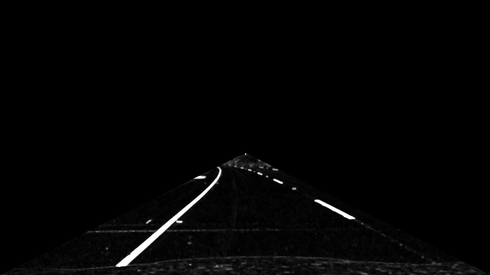 </p>

To take advantage of the difference in color between the street and the lines, we also use the derivatives (in X and Y direction) which calculate the difference in intensity in the X and Y axis. Finally, combining all these masks we will have the lines of the road perfectly visible and differentiated from the rest of the road. We can see the lines of the street detected in the following image.

It is important to consider that an additional mask is applied in the region where it is possible to find the lines, so that the upper portion of the image is not taken into account.

#### <center> **Combined masks** </center>
--------------------
<p align="center" width="100%">
 </p>


## Perspective transformation

#### <center> **Perspective transformation points** </center>
--------------------
<p align="center" width="100%">
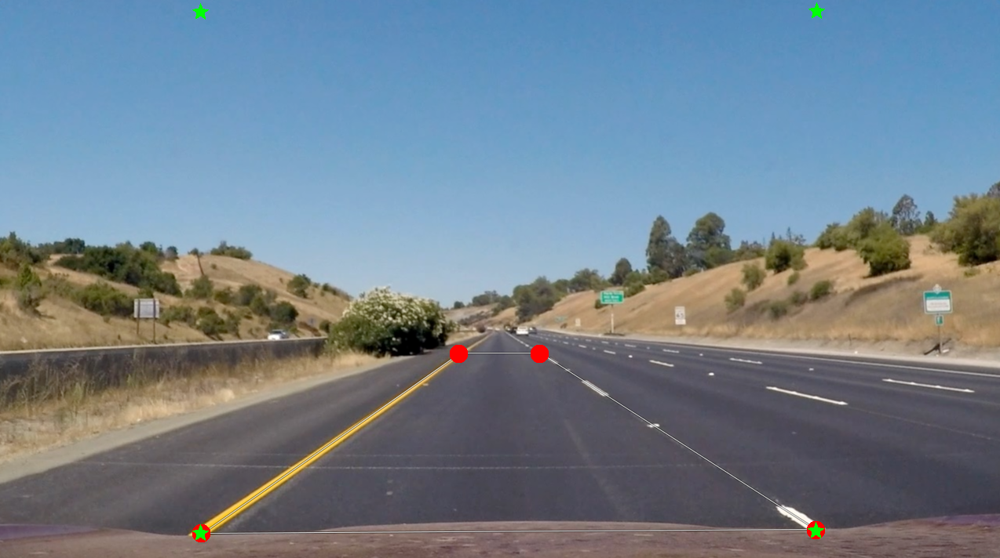 </p>

In order to estimate the real line from the mask image, and to estimate the curve of the line in the further steps, is necessary to have a top view of the road (and the lines). To achieve this, a picture where the lines seems rect is used, and with this assumption we take 4 points that belong to the line, and transform the whole image so that the line looks straight.  this kind or transformation is also called a bird's eye transformation. In the example image, the red dots are the lane lines, and the transformation is relating these points with the green stars.

Mask image transformed (curve lane)    |  Original image transformed (curve lane) 
:-------------------:|:---------------------------:
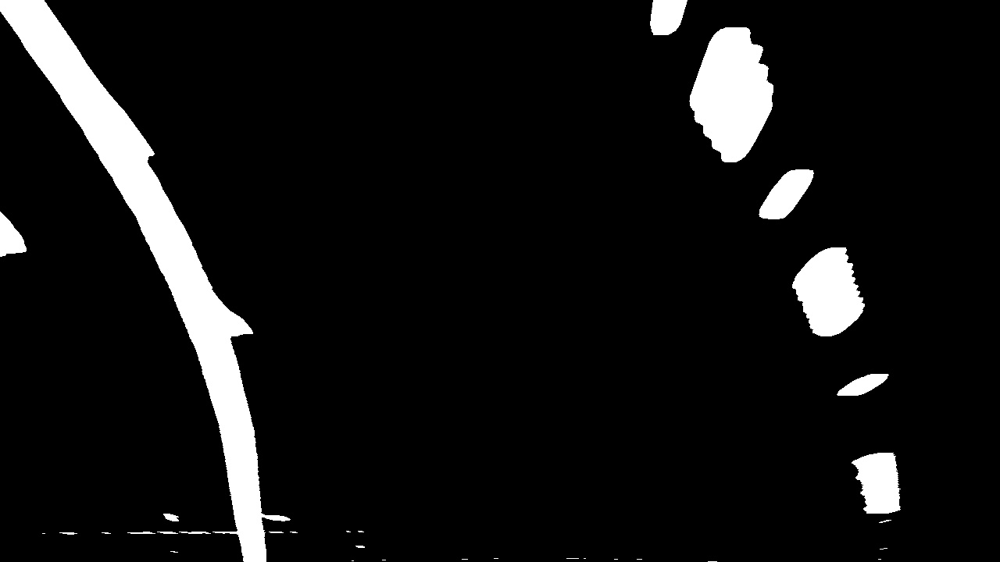  </p>  |  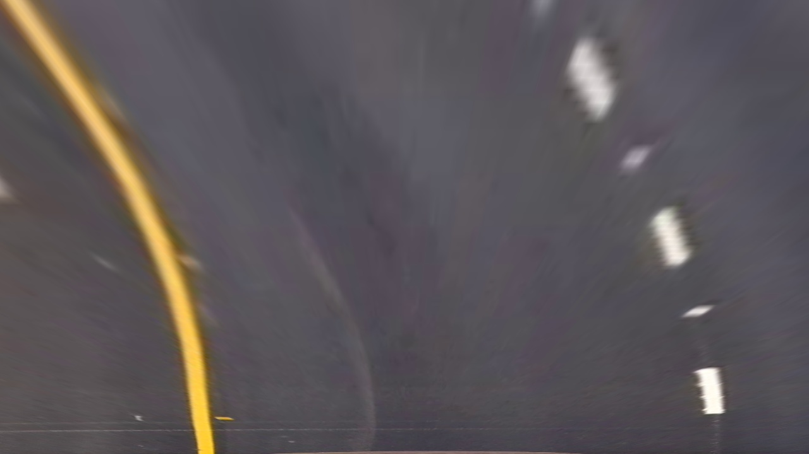 </p> 

The next step is to detect all the line pixels and to make a difference between the right and left line. To do that in the first iteration, we start loking at the point where there are a big conentration of points in the X-axis, in other words, if we detect many points with close to the same X-coordinate value, it is possible that there is the beginning of the line.

To accomplish this task, the histogram of the x-coordinates in the lower section of the binary image is calculated, and the peaks are consider as starting points to start finding the lines.

## Line detection

#### <center> **First line detection** </center>
<p align="center" width="100%">
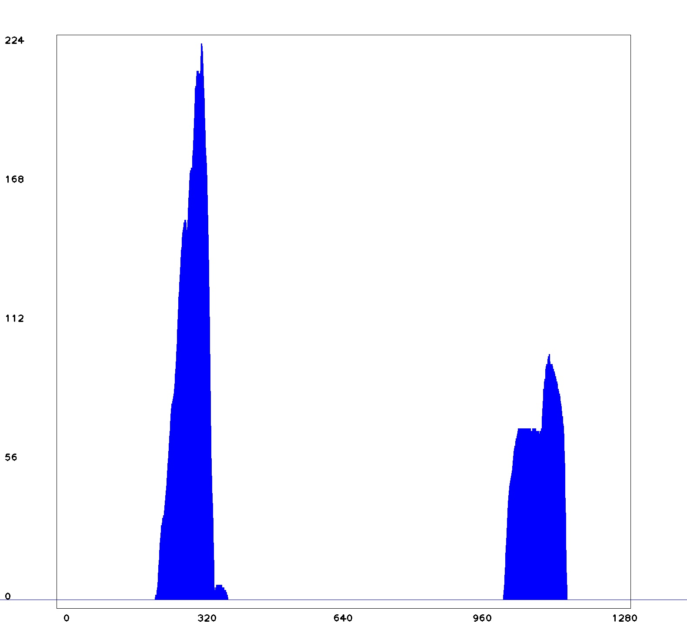  </p>  

Once we have detected these peaks, we use them as a base for the next step: search based on sliding windows.

With this method, we search in each iteration for all the pixels inside the search window, and we update the next windows center based on the centroid of all the points detected in the previous window.

#### <center> **Sliding windows search** </center>
<p align="center" width="100%">
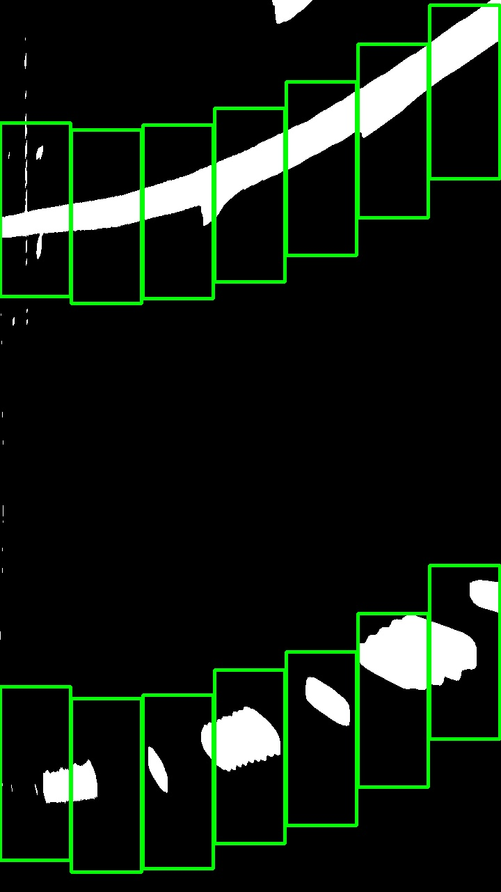 </p>

After all the pixels that belong to the line are detected, an approximation to a second order polynomial is made using least squares polynomial curve fitting method, and this result is considered as the detected line.

[Polynomial curve fitting reference](https://www.programmersought.com/article/50515052663/)

## Line fitting

#### <center> **Line estimation** </center>
<p align="center" width="100%">
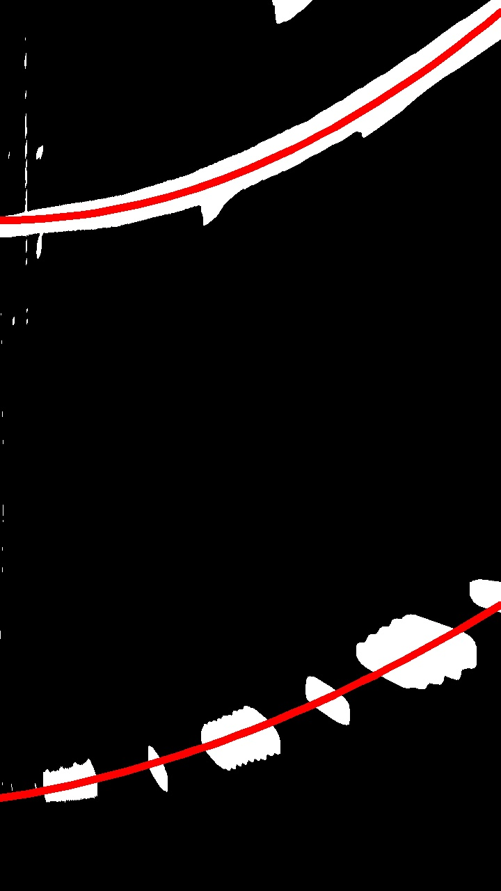 </p>

For the rest of the iterations, it is no longer necessary to recalculate the beginning of the line to perform a search with sliding windows. Instead, a search is performed considering the region near to the line detected in the previous step. This step improves the performance of the algorithm by being able to detect all points of the line in a single iteration.

#### <center> **Search window based on previous line** </center>
<p align="center" width="100%">
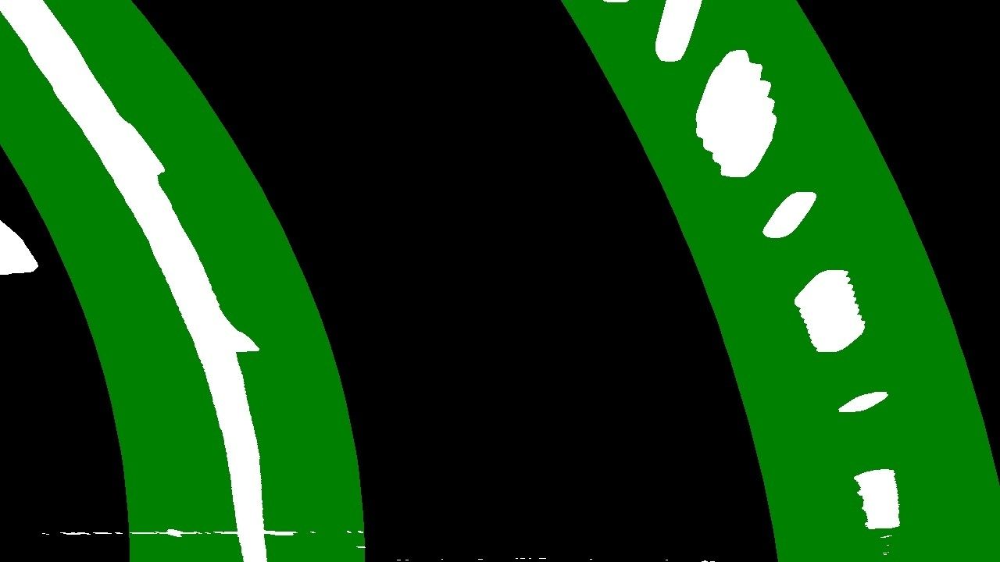 </p>

Finally, the detected line as well as the track are drawn and 
retransformed into the original shape, and finally added to the input image. Other important information such as track curvature and distance from the center of the vehicle to the center of the lane are calculated in the final step, and also added to the input image.

# Vehicles detection

The second goal of this excersise is to identify vehicles in the video. To do this we will implement a clasifier based on SVM (Support Vector Machine) in combination with a sliding window algorithm, to detect the vehicles position in the image.

## Trainning the clasifier

The set of labeled images from the [GTI vehicle image database](http://www.gti.ssr.upm.es/data/Vehicle_database.html) were taken as training data for the SVM. 

We can see in the following table an example of the labeled images.

<center>

 Positive images             | Negative images              
:-----------------------------:|:-----------------------------:
  |  
  |  
  | 

</center>


The objective is to obtain as much information as possible from these images, and we need this information to be sufficiently representative of the class we want to predict.

To do this, the following characteristics will be extracted from the images, and they will be concatenated into a single vector to be used as input in the training phase of the classifier.

* [HOG Features](https://www.learnopencv.com/histogram-of-oriented-gradients/)

HOG detectors are commonly used for object detection. It counts how many times the orientation of a gradient is repeated in a portion of the image.

* Histogram of colors

The color histogram gives us information about the distribution of color values in an image.

* Spatial binning

This vector gives us the information about the spatial distribution of the colors in the image. 


The following diagram shows the process of extracting features from an image, from which we obtain the vector that best represents our sample. The final result will be a feature vector in a single array representation. At the end wi will have a Matrix of F[N(rows) x M(columns)] (N: number of samples, M: number of features) that represents all our training set.

#### <center> **Features vector** </center>
<p align="center" width="100%">
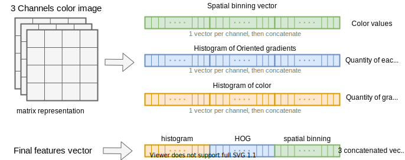 </p>

## Vehicles detection

Once our classifier is trained, we will use it to give us a prediction for a set of samples in each frame of the video. To limit the search region, and optimize the computing power, the search region will be limited only to the area where there may be vehicles. This zone is shown with the green rectangle in the following image

#### <center> **Searching zone** </center>
<p align="center" width="100%">
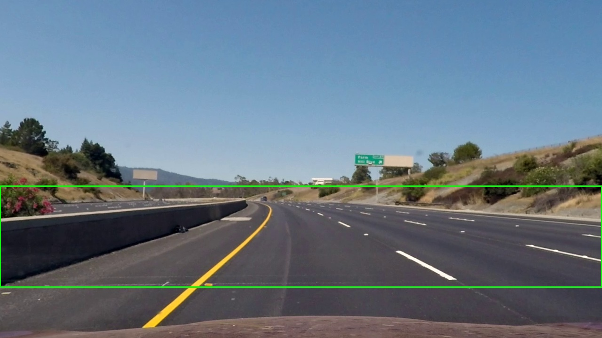 </p>

Once the search area is established, the algorithm of sliding windows is applied to predict for each window whether it is a vehicle or not. In the following image you is posible to see the overlapping of windows in the search area. Additionally, two windows were added, highlighted in green to appreciate the size of each one. This last one is a configurable parameter, as well as the percentage of overlap between the windows, which greatly affect the performance detection and time.

#### <center> **Small ROIs** </center>
<p align="center" width="100%">
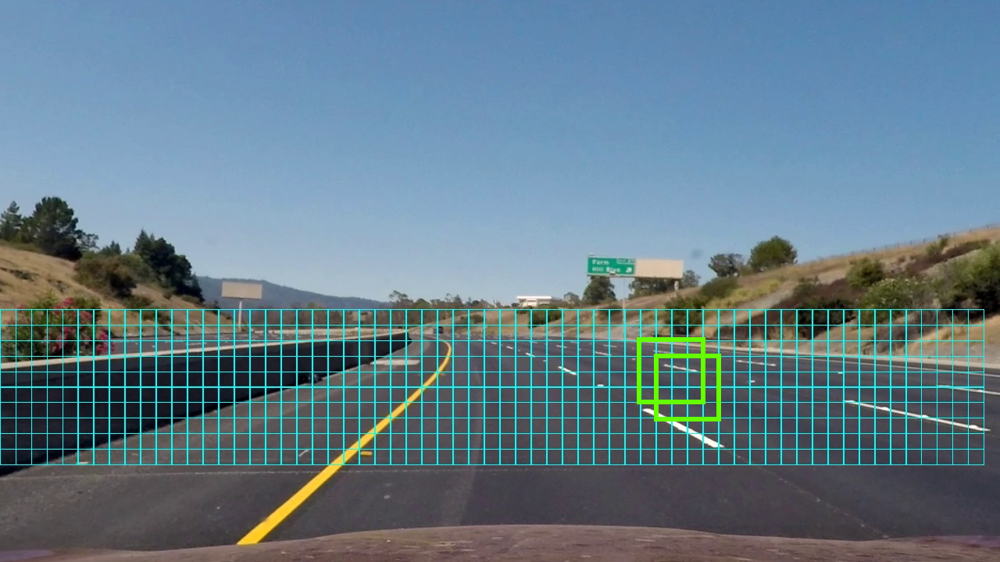 </p>

As a final step, a filtering algorithm by number of occurrences is applied. A mask (also called heat-map) is generated in which the areas where positive predictions overlaps are shown with greater intensity. Additionally, these masks are stored for a limited amount of temporarily continuous frames to consider the consistency of the occurrences in the time.

This heat map, in parallel with the final detection of the detected contour is shown in the table below.

## Reject false positives

 Heat map (mask)               | Heat map (contours)              
:-----------------------------:|:-----------------------------:
 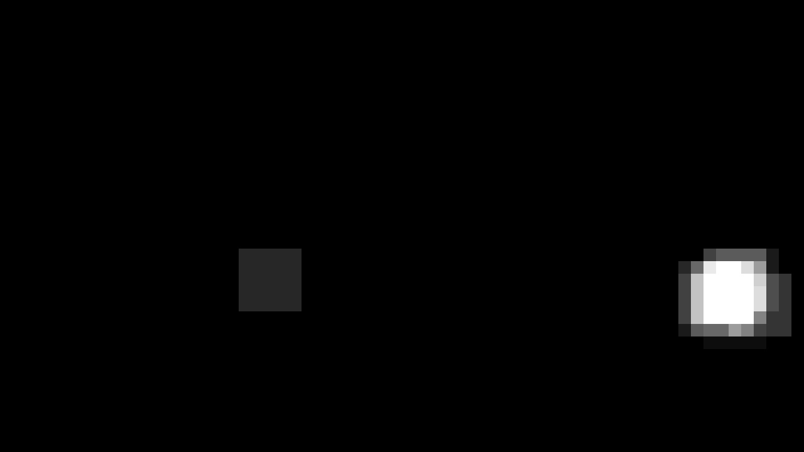 | 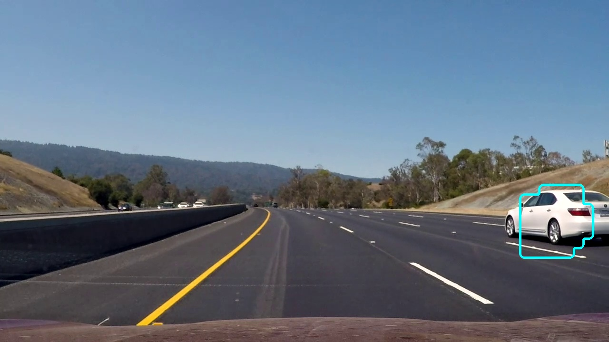 
 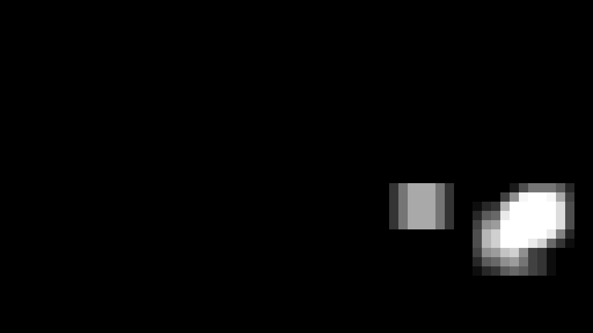 | 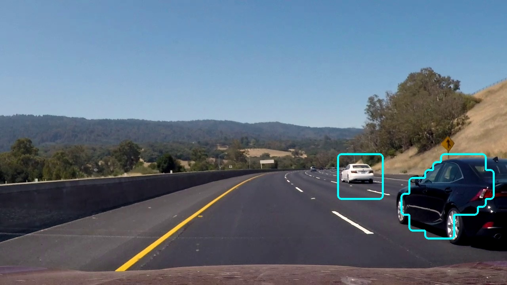 
 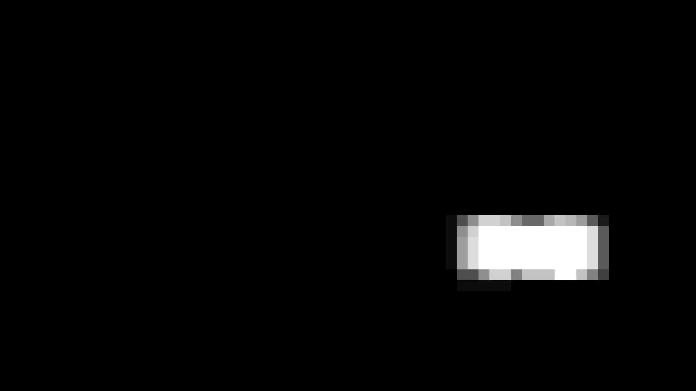 | 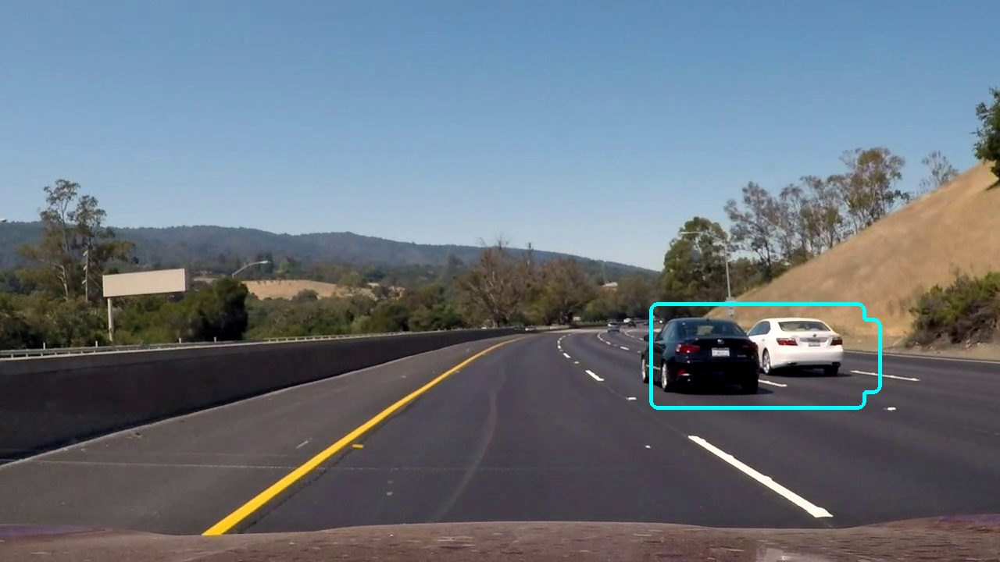 
 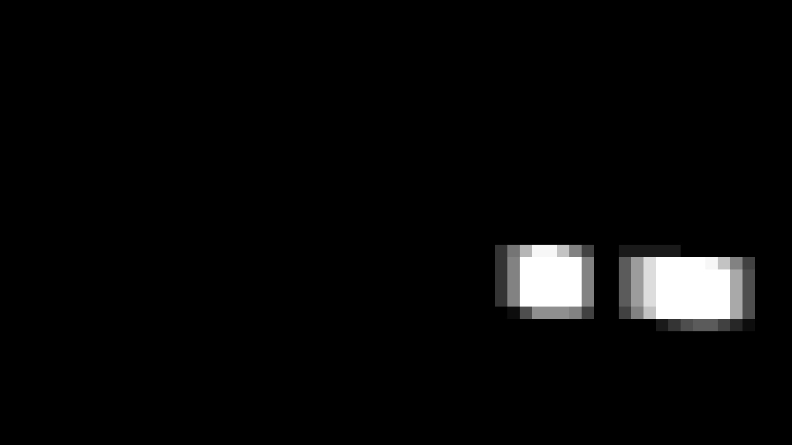 | 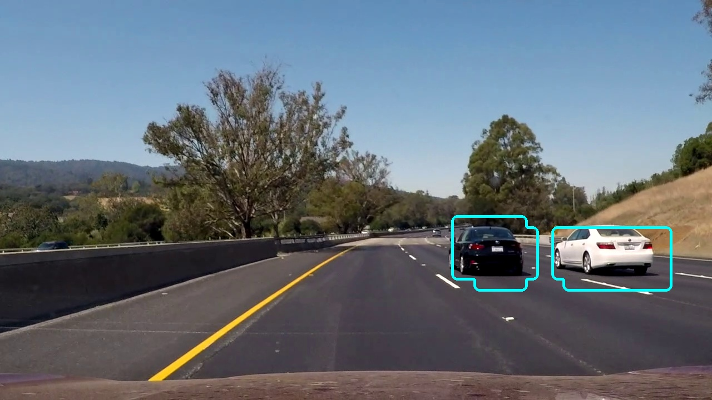 


## Installation

To test the code, you must follow the instruction to build the programs:

```bash
git clone THIS-REPO-URL
cd LaneObject
mkdir build
cd build
cmake ..
make
```


## Usage

**Verify paths in main file**

Trained SVM images must be stord in:
```bash
LaneObject-FOLDER/trained_svm.xml
```

camera calibration file must be stord in:
```bash
LaneObject-FOLDER/calibration_file.xml
```

Input video must be stord in:
```bash
LaneObject-FOLDER/videos/project_video.avi
```

For Car detection only:
```bash
cd build
./cars
```

For Lane detection only:
```bash
cd build
./lanes
```

For the complete pipeline (cars + lanes detection):
```bash
cd build
./main
```


**To train the clasifier** \
Labeled images must be stord in: \
```bash
LaneObject-FOLDER/data/train_data/positive
LaneObject-FOLDER/data/train_data/negative 
```


```bash
cd build
./clasifier
```

the trained clasifier will be saved in:
```bash
LaneObject-FOLDER/trained_svm_2.xml
```


