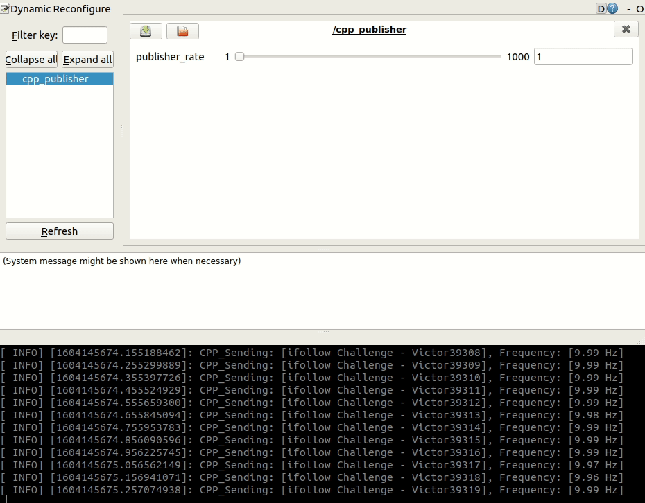
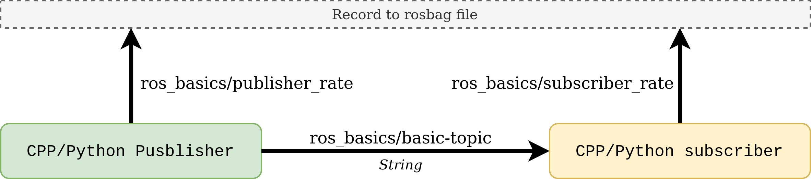
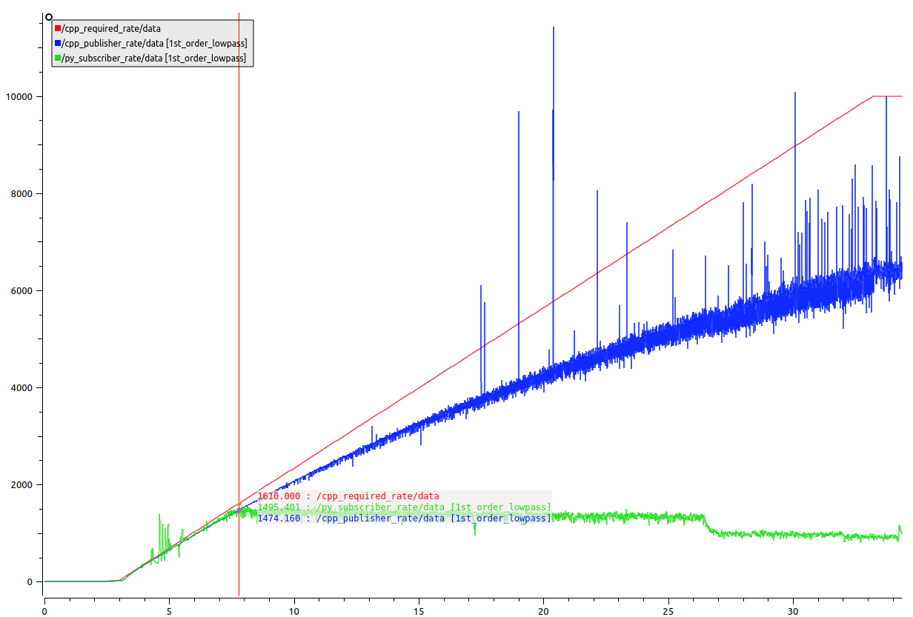
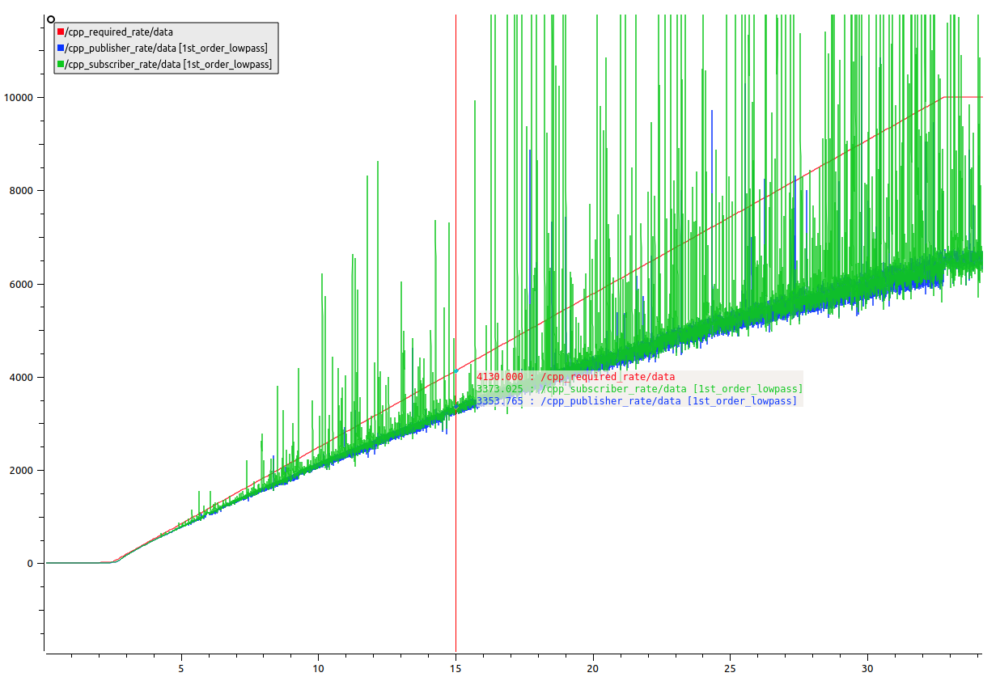
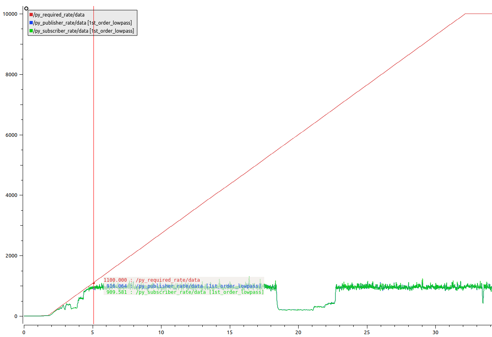
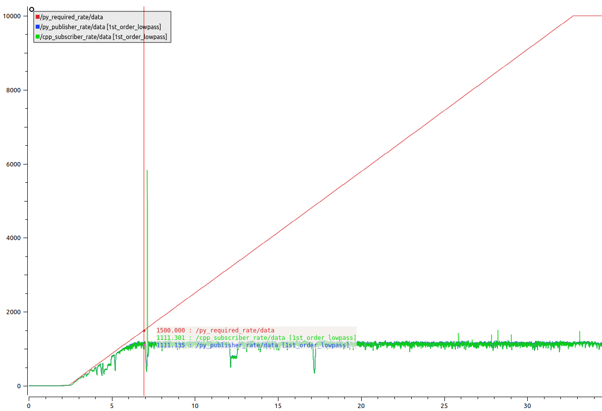
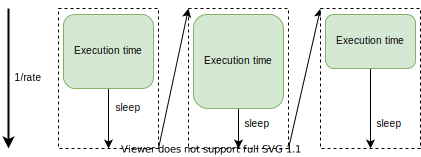
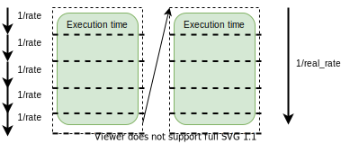

# ROS performance test

It is well known that ROS C++ is faster than ROS
Python. Is it really true?

To prove this we are going to implement four types of nodes and ilustrate the performance difference between the possibles combinations.

## Implementation

Four combinations publisher-subscriber were tested. To measure the performance difference we measure individually the loop subscriber/publisher rate for differents values of publishing rate.

* A)   CPP publisher -> Python subscriber
* B)   CPP publisher -> CPP subscriber
* C)   Python publisher -> Python subscriber
* D)   Python publisher -> CPP subscriber

In order to test these combinations for a large number of publishing rates, an option was added to change the publishing rate dinamically when the node were running.

<p align="center" width="100%">
 </p>

Additionally, to ensure that the real loop rate is well measured, each node sends a message to an aditional topic to publish their current rate. To ensure that the comparision is correct, all publishers (both python and c++) does exactly the same function: send a String message, send their loop rate, and receive the required loop rate information while running. Similarly, subscribers (both python and c++) receives a string message and publish their current loop rate.

<p align="center" width="80%">
 </p>

## Results

* A) CPP publisher -> Python subscriber
    * Red line: Required publishing rate
    * Blue line: Cpp pusblishing rate
    * Green line: Python subscriber rate
    
<p align="center" width="80%">
 </p>


Is possible to see in the graphic that the python subscriber cannot handle a receiving rate higher than ~1.5 KHz. After the publisher rate reaches this value and starts increasing, the subscriber rate gets stuck around that value.

* B)   CPP publisher -> CPP subscriber
    * Red line: Required publishing rate
    * Blue line: Cpp pusblishing rate
    * Green line: Cpp subscriber rate
<p align="center" width="80%">
 </p>

This is the fastest combination. In this case we see that the real publishing rate increases continuously, and do not gets stuck for any value in the test range.

With respect to the publisher, it does not faithfully follow the required rate, but nevertheless does not gets stuck and has some peak values that reaches that value. On the other hand, the subscriber remains limited by the speed of the publisher.

We can say for this test, and for comparative terms among the other cases that the maximum frequency value is +6KHz

* C)   Python publisher -> Python subscriber
    * Red line: Required publishing rate
    * Blue line: Python pusblishing rate
    * Green line: Python subscriber rate
<p align="center" width="80%">
 </p>

When seeing this result it begins to be obvious that the node in Python has a much lower performance with respect to the previous ones. In this case, we see how the publisher is stuck around ~1KHz, as well as the subscriber, but the last one is limited by the speed at which it is receiving

* D)   Python publisher -> CPP subscriber
    * Red line: Required publishing rate
    * Blue line: Python pusblishing rate
    * Green line: Cpp subscriber rate
<p align="center" width="80%">
 </p>

For the last case we have a similar result to the previous one, the python publisher is blocked at a frequency around ~1KHz. For the last case we have a similar result to the previous one, the python publisher is blocked at a frequency around 1KHz. And as we already have seen in the first results, the subscriber of C++ is able to read messages to a frequency much higher. We can conclude that this node this limited by the frequency to the that it is published in the topic

## Conclusion

To understand why this happens, it is important to understand the relationship between the loop rate configured in the node, and the computation time.

<p align="center" width="100%">
 </p>

The function that controls the loop frequency in ROS uses a timeout to achieve writing messages always at the same frequency. The ROS nodes handle this dynamically, sleeping the code the amount of time needed to complete a fixed period.

The problem occurs when the execution time takes more than the configured period, in this case, the code does not sleep and the publishing rate is given by the execution time of the node.

<p align="center" width="100%">
 </p>

For this reason the nodes in C++ works to a frequency higher that those of python, since a code in C++ (low level language) it is executed faster that the same code writed in Python (high level language).

In the case of subscribers, the same logic applies. If the computation time is longer than the time between messages, the following messages are lost (or kept in the queue) until the code is finished processing and the next one is read.

## Installation

To test the code, you must follow the instruction to build the ROS nodes:

```bash
git clone https://github.com/vgarciac/if_challenge.git
cd ROSBasics
mkdir build
cd build
cmake ..
make
```

## Usage

Terminal 1
```bash
roscore
```

Terminal 2
```bash
rosrun ros_basics cpp_publisher
```

Terminal 3
```bash
rosrun ros_basics py_subscriber
```

Terminal 4
```bash
rosrun rqt_reconfigure rqt_reconfigure
```

Terminal 5 (optional, to save the information for post-analysis)
```bash
rosbag -O performance_cpp_py -a
```
