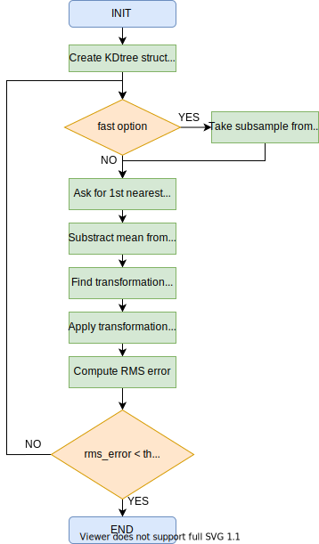
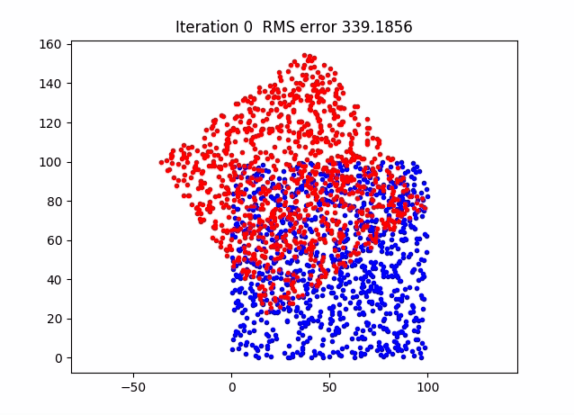
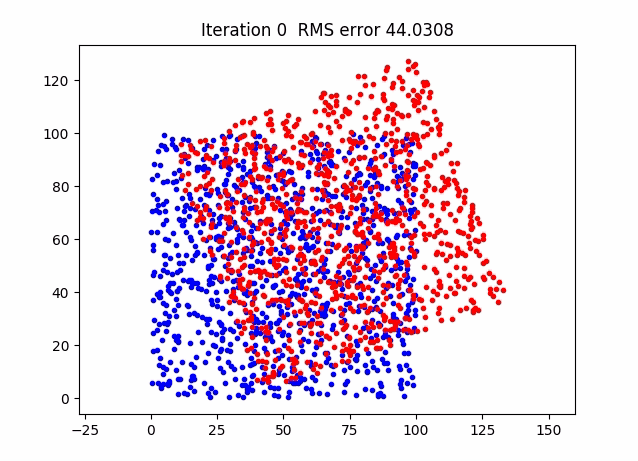

# 2D ICP Matching algorithm

The ierative closest point is an algorithm implemented to minimize the difference between two set of points. Often used to reconstruct 2D/3D surfaces from differents scans, to correct robots localisation, etc.

## Implementation

Referene:
https://cs.gmu.edu/~kosecka/cs685/cs685-icp.pdf

In basic terms there are some variants when implementing this algorithm:
* Points selection
* Weighting the corresponding points
* Data association
* Outliers rejection

For this implementation we use:
* Points selection method:
    * All points (for smalls set of points)
    * Uniform sub-sampling (for bigger set of points)
* Data association method:
    * KD-trees closest point

The algorithm can be visualized in the following diagram:

<p align="center" width="100%">
 </p>

## Results

As testing case, a random set of points is created. Then, a random rotation and translation transformation is applied, and finally the points are random shuffled. The algorithm is take these two point sets to compute the final rigid transformation between the sets **A** and **B**.

The progress of the algorithm while running to find the best transformation, is ilustrate ins the following animation:

### Example 1
 </p>

### Example 2
 </p>

## Usage

To test the code, you must follow the instruction:

### Generate random sets of points

```python
if __name__ == '__main__':

    # Create points ans save them
    points_ref, points = create_points(1000)
    np.save('points_ref.npy', points_ref)
    np.save('points.npy', points)
    ...
    ...
    # Define parameters
    max_iter = 200
    RMS_threshold = 0.01
    n_samples = 200
    # Apply ICP
    data_aligned, R, T = ICPMatching(points_ref, points, max_iter, RMS_threshold)

```

### Load sets of points

```python
if __name__ == '__main__':
    ...
    ...
    # Load data
    points_ref = np.load('points_ref.npy')
    points = np.load('points.npy')
    # Define parameters
    max_iter = 200
    RMS_threshold = 0.01
    n_samples = 200
    # Apply ICP
    data_aligned, R, T = ICPMatching(points_ref, points, max_iter, RMS_threshold)

```